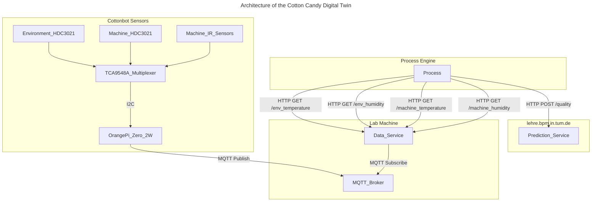

# Cotton Candy Digital Twin

This repository hosts the Digital Twin implementation for our **Cotton Candy Automata** — an automated system for crafting the perfect cotton candy. Our goal is to build a **prescriptive digital twin** using a combination of physical sensors, embedded computing, and machine learning.

---

## 🛠️ Components

### 🤖 Cotton Candy Automata  
🔗 [Cotton-Candy-Automata v1.0](https://github.com/NicolasArteaga/Cotton-Candy-Automata-1.0)  
A robotic setup designed to automate the cotton candy production process.

### 📡 Edge Device – Orange Pi Zero 2W  
The **Orange Pi Zero 2W** serves as an **edge node**, interfacing with sensors and forwarding real-time data to the central **lab server** via **MQTT**. It handles lightweight tasks such as I²C communication and initial preprocessing.

### 🌡️ Sensors

| Sensor | Description | Link |
|--------|-------------|------|
| 2× Adafruit HDC3021 | Precision Temperature & Humidity Sensor (STEMMA QT / Qwiic) | [Product Page](https://eckstein-shop.de/Adafruit-HDC3021-Precision-Temperature-Humidity-Sensor-STEMMA-QT-Qwiic) |
| 2× Contactless IR Temp Sensors | Non-contact infrared temperature detection | [Product Page](https://eckstein-shop.de/WaveShare-Contactless-Infrared-Temperature-Sensor-for-33V-5V-MCU) |
| 1× TCA9548A | 8-Channel I²C Multiplexer (STEMMA QT / Qwiic) | [Product Page](https://eckstein-shop.de/Adafruit-PCA9548-8-Channel-STEMMA-QT-Qwiic-I2C-Multiplexer-TCA9548A-Compatible) |


### 🔌 Cables

| Cable | Quantity | Link |
|-------|----------|------|
| Qwiic to Female Jumper | 1× | [Product Page](https://eckstein-shop.de/SparkFunQwiicCable-FemaleJumper4-pin2CI2C2F28AWG2F15cm) |
| Qwiic JST SH 4-Pin (100mm) | 4× | [Product Page](https://eckstein-shop.de/STEMMAQT2FQwiicJSTSH4-pinCable-100mmLongforallSensor2FDriverBoardswithQwiic) |
| Qwiic JST SH 4-Pin (300mm) | 2× | [Product Page](https://eckstein-shop.de/Adafruit-STEMMA-QT-Qwiic-JST-SH-4Pin-Cable-300mm-Long) |

---

## 🧩 Integration Overview
All sensors connect to the Orange Pi Zero 2W via I²C through the multiplexer. The Pi collects and forwards data over **MQTT** to a **central lab server**, where the actual digital twin logic and AI models are executed. This distributed architecture separates data acquisition (edge) from computation (server).

---

## Architecture




## 🔧 Setup Instructions

```bash
git clone https://github.com/NicolasArteaga/Cotton-Candy-Digital-Twin.git
cd Cotton-Candy-Digital-Twin

sudo apt update
sudo apt install python3-pip python3-dev libgpiod2 libgpiod-dev python3-libgpiod -y

sudo pip3 install -r requirements.txt

```